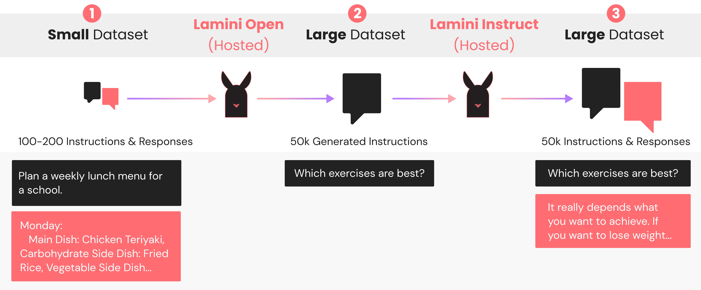

# Lamini: The LLM engine for rapidly customizing models 🦙
[](/LICENSE.txt)
[](https://www.python.org/downloads/release/python-370/)
[](https://github.com/psf/black)


Official repo for Lamini's data generator for generating instructions to train instruction-following LLMs.

All data and LLMs are under a CC-BY license that allows commercial use—all yours, you own it! 🦙🦙🦙

What's here?
- A [71K dataset of instructions](#data-release) used for finetuning your own instruction-following LLM (like ChatGPT, which was also trained to follow instructions).
- The code for the [data generator](#run), which only needs 100 datapoints to start generating 70k+ datapoints. You can customize the original 100+ datapoints to your own domain, to focus the data generator on that domain.
- Open-source fine-tuned LLMs that follow instructions, fine-tuned using a base Pythia model with the Lamini engine: [[weights](https://huggingface.co/lamini/instruct-tuned-2.8b)] [[playground](https://huggingface.co/spaces/lamini/instruct-playground)].

See our [blogpost](https://lamini.ai/blog) for layperson's terms of what's going on.




## Authentication to Lamini

Ready to configure your API key? It's easy-peasy! 🔑

First, navigate to your [Lamini account page](https://app.lamini.ai) to retrieve your unique API key. Remember to keep this key a secret, and don't expose it in any client-side code or share it with others.

Next, create a config file, like so:

```
mkdir ~/.powerml
touch ~/.powerml/configure_llama.yaml # backend system names
```

Finally, open the file with a text editor and place your key in it:

```
production:
    key: "<YOUR-KEY-HERE>"
```

The best part? The [Lamini python package](https://pypi.org/project/llama-llm) will automatically load your key from this config file for you, so you don't have to worry about it 🙌

If you're running Lamini in a docker container, make sure to copy/mount this file inside the container 🐳

See our [API docs](https://lamini-ai.github.io/auth/) for more details.

## Run
Clone the repository:
```
git clone git@github.com:lamini-ai/lamini.git
```

### Using Python 🐍

In the repository, install python dependencies:

```
pip install -r requirements.txt
```

Run the program, to start generating data 📊📊📊

```
python3 generate_data.py
```

### Using Docker 🐳

Make sure you have [docker](https://docs.docker.com/get-docker/) installed.

Then, run this command:

```bash
./run_generate_data_docker.sh
```

## Expected Outputs & Autosaved Data 🦙
When you run the program, you should start seeing output of a `Seed Question`, from the original small dataset in [`seed_tasks.jsonl`](./seed_tasks.jsonl), and a `Novel Question`, which is a generated question based on that `Seed Question`.[^1]
[^1]: The `Seed Questions` in the Lamini seed dataset are instructions (combination of questions and commands), based on the [self-instruct dataset](https://github.com/yizhongw/self-instruct). The generated questions are similar in nature to those and therefore don't *have to* be questions. You can find the seed dataset at `data/lamini_dataset.jsonl`.
```
====== Seed Question =====
 question='Plan a weekly lunch menu for a school. Write down a main dish, a carbohydrate side dish, a vegetable side dish, and a dessert for each day.'
===== Novel Question =====
 question='Write a knock knock story that has the same theme as the given one, but the characters, plots and settings are different'
```
These generated questions are saved to `data/questions.jsonl`. This JSON file is a list of dictionaries with a `question` field.

Next, you'll see a `Response` generated for each `Novel Question`.
```
====== Question =====
 question='Which exercises are best'
===== Response =====
 response='It really depends what you want to achieve. If you want to lose weight, I would recommend high intensity interval training (HIIT) because it is really effective. If you want to gain muscle, I would recommend steady-state cardio like running or walking as these help maintain muscle mass. If you are interested in both losing weight and gaining muscle, I would recommend a combination of both HIIT and steady-state cardio.\n\n\nHIIT exercises are: running fast for short periods of time, followed by slow walking or jogging for longer periods of time. An example of a HIIT exercise is called the “Lunges'
```

These pairs are saved to `data/dataset.jsonl`. This JSON file is a list of dictionaries with `question` and `response` fields.

It's poggers 💥

## Modify

### I want to use my own seed data
We suggest creating your own dataset and changing the path to the [`seed_tasks.jsonl`](./seed_tasks.jsonl) in `generate_data.py`(./generate_data.py) --- or you can replace  [`seed_tasks.jsonl`](./seed_tasks.jsonl) with your own data in the same format. You can of course also modify how the data is loaded or write your own script with the `llama-llm` library (pssst, [API docs](https://lamini-ai.github.io/auth/)).

### I only want to generate questions (to start)
In `generate_data.py`(./generate_data.py), you can just run `generate_questions`. This is a common use case for using human review after the question generation step to filter only the good ones for the next step of generating a response for each question.

### I have my own instructions, and just want to generate responses
In `generate_data.py`(./generate_data.py), you can just use the function `make_pairs` to create the question-response pairs. This is a common use case step to run this stage separately, e.g. after human review of the generated questions, or if there was an error at this step last time.

### I want to generate more than 100 instructions
Change the count flag `-c` for the number of question-repsonse pairs to generate in total. The default is set to 100.

## Cleaning

### Using Python 🐍

In the repository, run the `remove_duplicates.py` to remove duplicate questions from data/dataset.jsonl

```
python3 remove_duplicates.py
```

Run the program, to perform a basic cleaning job on your data 🧼🧼🧼


In the repository, run the `remove_duplicates_completion.py` to remove responses where the model repeats itself from data/dataset.jsonl

```
python3 remove_duplicates_completion.py
```

Run the program, to perform a more extensive cleaning job on your data 🛁🛁🛁

These are examples.  Consider using human filtering or writing additional post processing programs to further clean and improve your data.  Your fine-tuned models will thank you!


## Data Release
We've run this script a few times and saved the results for you to freely use, at [`data/lamini_dataset.jsonl`](./data/lamini_dataset.jsonl) 💸

This file contains 72K instruction-following data for commercial use (ie. feel free to use it for your business! 💰📈). It's the same as the output, a list of dictionaries, each of which contains the following fields:
- `question`: `str`, describes the task the model should perform. Each of the 52K instructions is unique, as generated by `lamini/open`.
- `response`: `str`, the answer to the instruction as generated by `lamini/instruct`.

## About Lamini
[Lamini](https://lamini.ai/) is the world's most powerful LLM engine, unlocking the power of generative AI for every company by putting their data to work. It is based on the [lamini tribe](https://en.wikipedia.org/wiki/Lamini), which includes llamas (LLMs!), alpacas, etc.
