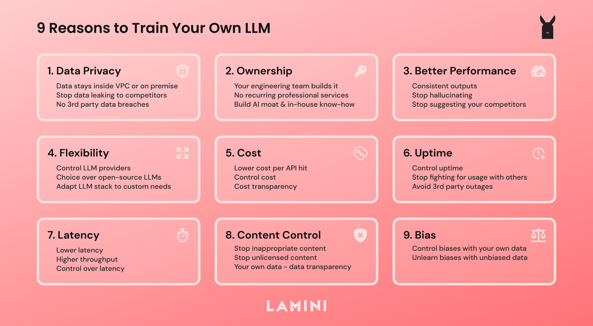

# Lamini: The LLM engine for rapidly customizing models 🦙
[](/LICENSE.txt)
[](https://www.python.org/downloads/release/python-370/)
[](https://github.com/psf/black)

<p align="center">
  
</p>

Official repo for Lamini's finetuning pipeline, so you can train custom models on your data.

- It's free, on small LLMs
- It's fast, taking 10-15 minutes
- It's like working with an unlimited prompt size, with 1000x+ more space than the largest prompts
- It's learning new information, not just trying to make sense of it given what it already learned (retrieval-augmented generation)

What's here?
- 1400 question and answer dataset (it's about Lamini's internal engineering docs, but you can customize it to your own data)
- The code to run LLM finetuning on this dataset
- Open-source fine-tuned LLMs that answer questions (e.g. about Lamini, or whatever you'd like to customize it to)

See our [blog](https://lamini.ai/blog) for layperson's terms of what's going on. 

Train with ease, by walking through the [Colab notebook](https://github.com/powerml/Lamini-finetune).

This is an example of a tiny LLM performing basic finetuning. If, instead, you're thinking "I'm ready for the real deal 💪", if you want to build larger LLMs, run this live in production, host this on your own infrastructure (e.g. VPC or on premise), or other enterprise features, [please contact us](https://www.lamini.ai/contact).


## Overview
1. [Authenticate](#authentication-to-lamini)
2. [Run finetuning](#run) with Python or Docker
  ```
    # Instantiate the LLM
    from llama import QuestionAnswerModel
    model = QuestionAnswerModel()

    # Load data into the LLM
    model.load_question_answer_from_jsonlines("seed.jsonl")

    # Train the LLM
    model.train()

    # Compare your LLM: before and after training (optional)
    results = model.get_eval_results()

    # Run your trained LLM
    answer = model.get_answer("What kind of exercise is good for me?")    
  ```

3. [Modify the default dataset](#using-your-own-data) to your own

## Expected output
Here's what you should expect from the LLM before and after finetuning, i.e. on the question-answer [data](./data/seed.jsonl).

You ask the question: 
```
How can I add data to Lamini?
```

Before finetuning:
```
A:

I think you can use the following code to generate the
```

After finetuning:
```
You can add data to Lamini using the `add_data()` function. This function takes in a string of text and adds it to the model.
```

As you can see, the base model without finetuning is really off the rails and cuts itself off. Meanwhile, finetuning got the LLM to answer the question correctly and coherently! 

## Authentication to Lamini

First, navigate to your [Lamini account page](https://app.lamini.ai) to retrieve your unique API key. 🔑 Remember to keep this key a secret, and don't expose it in any client-side code or share it with others. When you log in, you can also track your training jobs. Finetuning the small default LLM is free.

Next, create a config file, like so:

```
mkdir ~/.powerml
touch ~/.powerml/configure_llama.yaml # backend system names
```

Finally, open the file with a text editor and place your key in it:

```
production:
    key: "<YOUR-KEY-HERE>"
```

The [Lamini python package](https://pypi.org/project/lamini) will automatically load your key from this config file for you, so you don't have to worry about it 🙌

If you're running Lamini in a docker container, make sure to copy/mount this file inside the container 🐳

See our [API docs](https://lamini-ai.github.io/auth/) for more details.

## Run
Clone the repository:
```
git clone git@github.com:lamini-ai/lamini.git
```

### Using Python 🐍

In the repository, install python dependencies:

```
pip install -r requirements.txt
```

Run the program, to start finetuning 

```
python3 training_and_inference.py
```

All that's happening in there are these easy steps to finetune:
1. Instantiate the LLM
```
  model = QuestionAnswerModel()
```

2. Load data into the LLM
```
  model.load_question_answer_from_jsonlines("seed.jsonl")
```

3. Train the LLM
```
  model.train()
```

4. Compare your LLM: before and after training (optional)
```
  results = model.get_eval_results()
```

5. Run your trained LLM
```
  answer = model.get_answer("How can I add data to Lamini?")    
```

### Using Docker 🐳

Make sure you have [docker](https://docs.docker.com/get-docker/) installed.

Then, run this command:

```bash
./run_finetuning.sh
```

This runs the Docker container and the script to finetune.

## Using your own data

To use your own data for finetuning, we suggest you creating dataset in the same format as the [`seed.jsonl`](./data/seed.jsonl) file in the [data](./data) folder. 

After that, you can put the new file in the data folder and then change the path in the [`training_and_inference.py`](./training_and_inference.py) file.

The [`seed.jsonl`](./seed.jsonl) follows following format:
```
{"question": "type your question", "answer": "answer to the question"}
```

Both the quality and quantity of the questions and answers help the LLM learn. Just like a person would :)

## Model Support

To use different models for finetuning, you can pass in model_name parameter to QuestionAnswerModel(), for example:
```
  model = QuestionAnswerModel(model_name="YOUR_MODEL_NAME")
```
Currently the free tier version supports limited models: 
- hf-internal-testing/tiny-random-gpt2
- EleutherAI/pythia-70m 
- EleutherAI/pythia-70m-deduped 
- EleutherAI/pythia-70m-v0 
- EleutherAI/pythia-70m-deduped-v0
- EleutherAI/neox-ckpt-pythia-70m-deduped-v0
- EleutherAI/neox-ckpt-pythia-70m-v1
- EleutherAI/neox-ckpt-pythia-70m-deduped-v1 
- EleutherAI/gpt-neo-125m
- EleutherAI/pythia-160m
- EleutherAI/pythia-160m-deduped
- EleutherAI/pythia-160m-deduped-v0
- EleutherAI/neox-ckpt-pythia-70m
- EleutherAI/neox-ckpt-pythia-160m
- EleutherAI/neox-ckpt-pythia-160m-deduped-v1
- EleutherAI/pythia-410m-v0
- EleutherAI/pythia-410m-deduped
- EleutherAI/pythia-410m-deduped-v0
- EleutherAI/neox-ckpt-pythia-410m
- EleutherAI/neox-ckpt-pythia-410m-deduped-v1
- cerebras/Cerebras-GPT-111M
- cerebras/Cerebras-GPT-256M
  
To add support for more models, contact Lamini team [here](https://www.lamini.ai/contact). 
## About Lamini
[Lamini](https://lamini.ai/) is the LLM platform for every developer to build customized, private models: easier, faster, and better-performing than any general purpose LLM.. It is based on the [lamini tribe](https://en.wikipedia.org/wiki/Lamini), which includes llamas (LLMs!), alpacas, etc.
